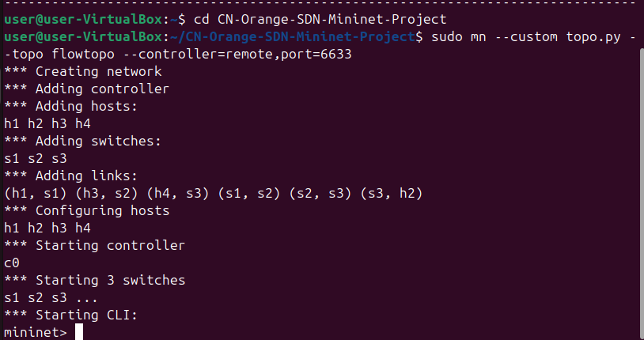
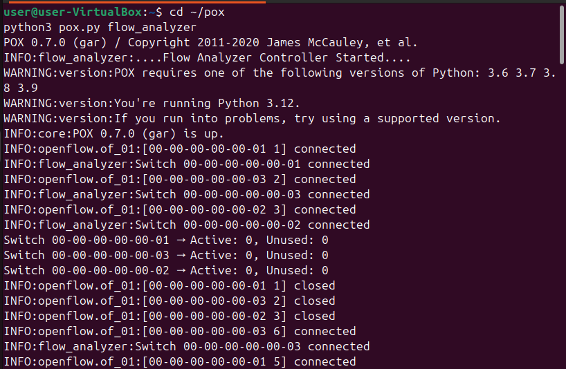
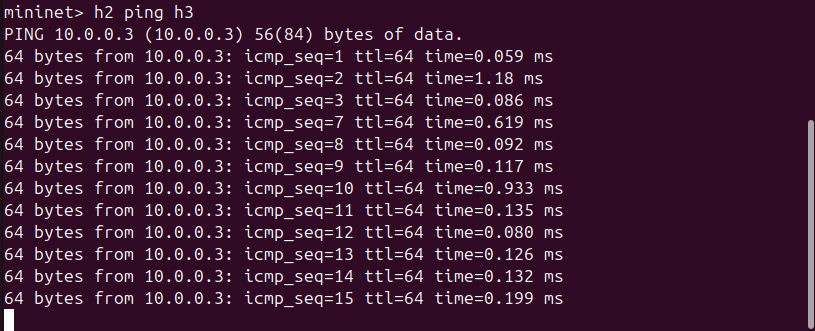
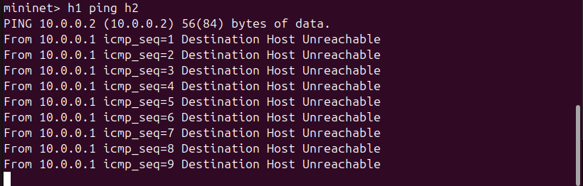
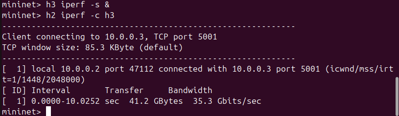
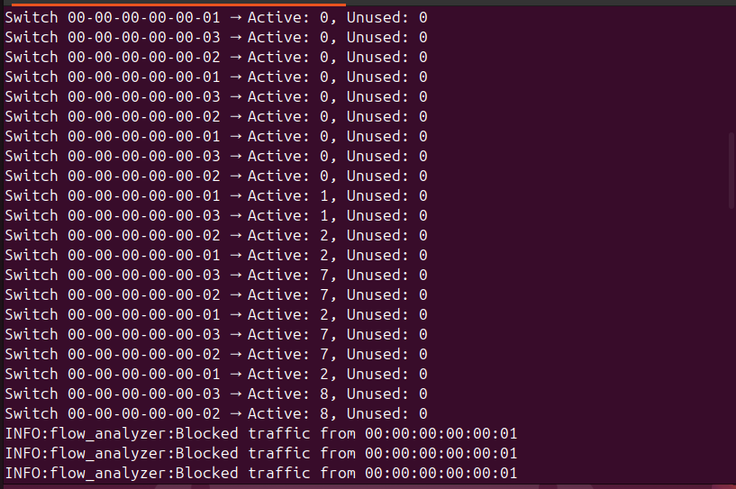
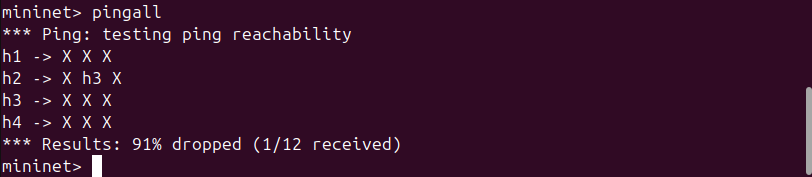

# Computer Networks - Orange Problem
## SDN Multi-Switch Flow Table Analyzer 

---

## Problem Statement

In Software Defined Networking (SDN), switches maintain flow tables to control packet forwarding. However, there is no direct mechanism to monitor how effectively these flow rules are utilized.

This project aims to design and implement a system that analyzes flow tables across multiple switches and provides insights into rule usage.

---

## Expectations

* Retrieve flow entries from multiple switches using OpenFlow
* Display flow rule details including match fields and statistics
* Identify active and unused flow rules based on packet counts
* Dynamically update and monitor flow table usage in real time

---

## Objective

* Demonstrate **controller–switch interaction** using OpenFlow
* Implement **match–action flow rules**
* Analyze **flow table usage dynamically**
* Demonstrate **network behavior (allowed vs blocked traffic)**

---

## Tools & Technologies

* **Mininet** – Network emulation
* **POX Controller** – SDN controller
* **OpenFlow Protocol** – Communication between controller & switches
* **iperf** – Performance testing
* **Python** – Implementation

---

## Network Topology

```
h1 --- s1 --- s2 --- s3 --- h2
           |       |
          h3      h4
```

---

##  Setup & Execution

### Start POX Controller 

```bash
cd ~/pox
python3 pox.py flow_analyzer
```

### Start Mininet In Another Terminal

```bash
cd ~
sudo mn --custom topo.py --topo flowtopo --controller=remote,port=6633
```

---

##  OpenFlow Working

1. Switch connects to controller
2. Packet arrives at switch
3. No matching rule → **Packet-In** sent to controller
4. Controller processes packet
5. Decision made (allow or block)
6. Controller installs rule using **Flow-Mod**
7. Switch forwards packets
8. Controller periodically requests **Flow Stats**
9. Switch replies with statistics
10. Controller analyzes rule usage

---

##  Test Scenarios

### Allowed Traffic

```bash
mininet> h2 ping h3
```
✔ Communication successful

### Blocked Traffic

```bash
mininet> h1 ping h2
```
✔ Communication fails (blocked by controller)

### Performance Test

```bash
mininet> iperf h2 h3
```
✔ Generates high traffic for analysis

---

##  Expected Output

```
Switch 1 → Active: X, Unused: Y
Switch 2 → Active: X, Unused: Y
```

---

##  Observations

* Active flow count increases with traffic
* Blocked traffic prevents rule installation
* Initial packet loss occurs due to reactive flow setup
* Flow statistics enable identification of rule utilization

---

##  Proof of Execution

Screenshots included:
### Topology Setup



### Controller–Switch Connection



### Allowed Scenario



### Blocked Scenario



### Performance Test (iperf)



### Flow Analysis



### pingall Result



---

##  Conclusion

This project successfully demonstrates:
* Dynamic flow rule installation
* Real-time monitoring of flow usage
* Traffic control using SDN controller logic
  
---

##  References

* Mininet Documentation
* POX Controller Documentation
* OpenFlow Specification

---

## Author
Nihira Hassan
4 B - AIML
